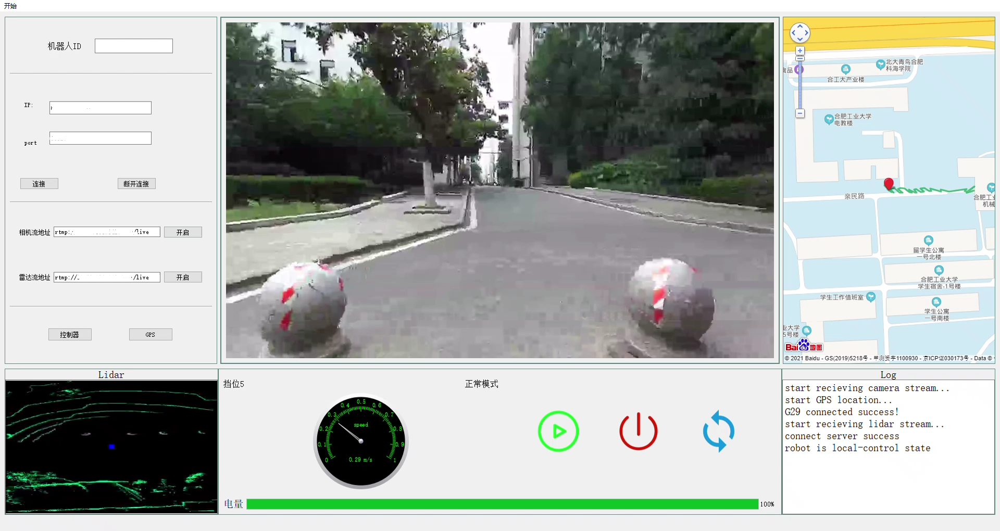
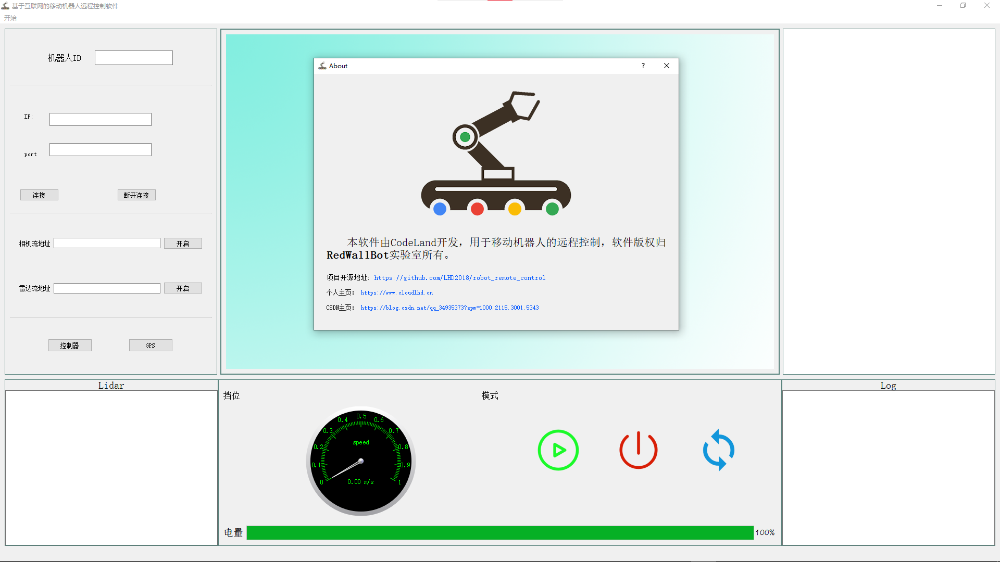

## 移动机器人远程控制软件

### 介绍
+ 为了方便后面远程调试移动机器人，开发此款软件用于远程驾驶，本质上是通过公网服务器作为转发实现机器人和远程客户端的通信，现软件以支持如下功能:
> 1. 过蓝牙手柄或罗技G29方向盘远程控制移动机器人运动
> 2. 支持同时传输两个rtmp视频流图像，可自定义，本软件传为前/后摄像头图像和激光雷达图像
> 3. 调用百度地图api，支持GPS数据定位以及轨迹记录
> 4. 通过mqtt通信实现远程启动关闭以及机器人电量的监控
> 5. 控制速度的码表显示
> 6. 保存配置，下次启动直接加载参数

---
### 可以在此基础上进行二次开发，现简单说明一下各个文件的功能
+ `ffmpeg`存放ffmpeg的头文件和库文件
+ `res`存放的一些背景图片和按钮图标
+ `index.html`百度地图的JavaScript调用api文件，里面需要填写你申请的百度地图key
+ `joystick`和`joythread`手柄和方向盘控制器的读取以及发送数据线程
+ `imgtransfer`拉取rtmp视频流的类
+ `camimgthread`和`lidarimgthread`分别是拉取相机和雷达视频流的线程，可以看到他们都是通过创建imgtransfer类的对象实现的
+ `mqttpubsub`处理mqtt通信的内容，这里需要QT编译[qmqtt](https://github.com/emqx/qmqtt)
+ `mysocket`和`socketworker`处理socket通信
+ `speeddial`速度表盘类
+ `mqttdialog`和`aboutdialog`mqtt参数设置和关于界面的对话框
+ `util`自定义一些工具函数
+ `mainwindow`主界面以及线程之间的通信操作

---
### 演示效果
+ [b站路测视频](https://www.bilibili.com/video/BV1964y1R7ag/)
+ 软件截图

 

---
**软件已申请著作权，登记号`2021SR1039291`**

